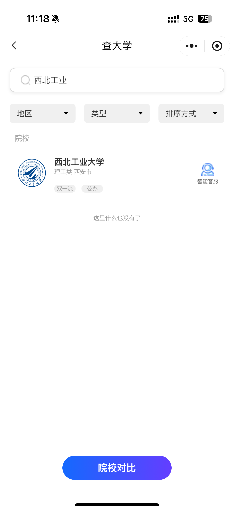
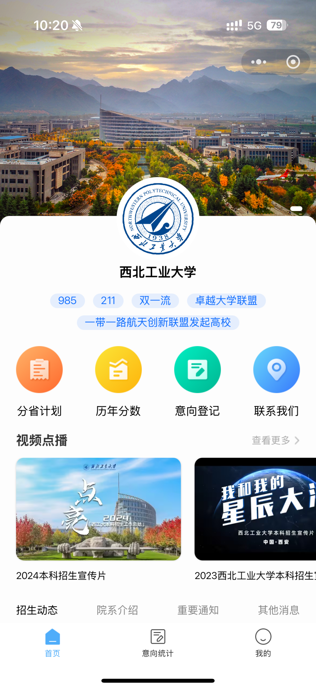
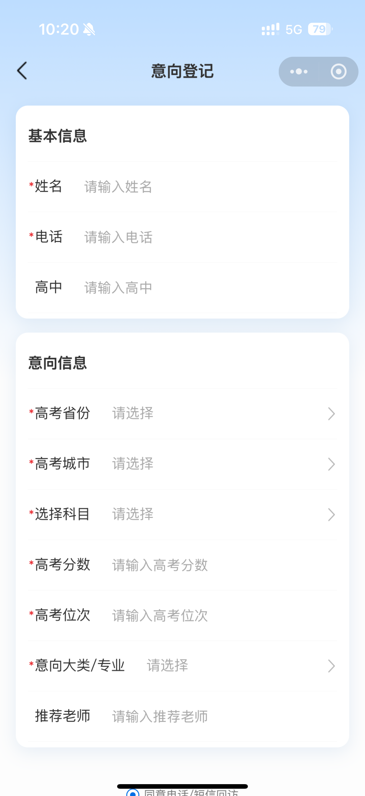

## 智慧校园招生小程序

**项目链接**

- 微信搜索：**探星者 AI志愿**（已下线）
  - 截止目前累计用户4922

- 微信搜索：**西工大招办**（已不再维护）
  - 截止目前累计用户6.24万

**使用技术**

React+Taro+styled-components+jotai

**项目描述**

本项目包括智慧招生系统和学校宣传小程序两个部分。智慧招生系统为高考考生提供院校基本信息查询及基于AI的志愿填报推荐；学校宣传小程序则分别展示各校详细信息、历年分数及招生情况，并允许学生预填考试信息供招生老师参考。

**项目职责**

负责智慧招生系统的核心页面开发，包括首页、个人信息展示及高级搜索功能。独立完成学校宣传小程序的前端开发，创建直观且功能丰富的用户界面。主导前后端数据对接，确保高效准确的数据传输，并持续优化系统性能。

**部分展示**

|  |  |  |
| ------------------- | ------------------- | ------------------- |
|  |  |                     |

|  |  |  |
| ------------------- | ------------------- | ------------------- |
|                     |                     |                     |

